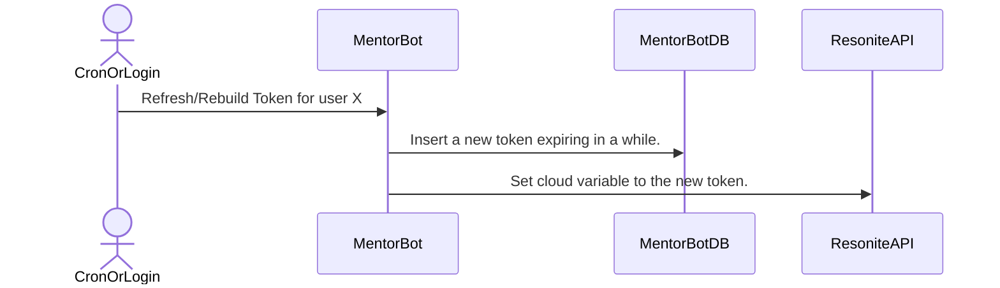
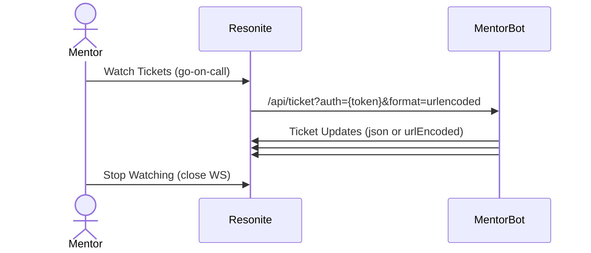

# Mentor Flows

[Root Doc (Start Here)](README.md)

It is assumed a mentor has [logged in](LoginFlow.md).

## Adding a Mentor

Leads convert a User into a Mentor via their dashboard, all registered users show up in that dashboard.

The process is covered in [Lead Flows](LeadFlows.md).

## Mentor Actions

### Resonite Authorization

Resonite-originating actions do not have header access, and there is no way for a Mentor to login from inside of Resonite. To get around this a protected cloudvar is used as a bearer token.

When a Mentor logs in, or when a token will expire 'soon'. Checking for expired tokens is done with a cronjob. Expired tokens are deleted by a cronjob.

Tokens are a binary blob, likely a large base64 cryptorandom number, but it may be a JWT in the future.  
*The token pattern is not web-best-practice and may be stolen, the difficulty of JWT revocation leans away from that approach, even if it has less DB queries.*

The cloud var is configured as `read:variable_owner`, `write:definition_owner_only`. Writing is done using the group-owner credentials.

When sending an authentication-requiring web reuqest, the `auth` query argument is used. The `auth` parameter only allows a subset of actions, such as claiming tickets. **Lead actions are explicilty not supported via this auth mechanism.**

## Claiming a Ticket

A post is made in Discord with emoji responses, responding to an emoji claims the ticket for that mentor.

## Watching for Tickets (Resonite Facet)

The mentor facet or web UI use a websocket to keep the UI in sync with the tickets in the service.

When a mentor claims a ticket, the WS connection updates the UI, not the POST method.

