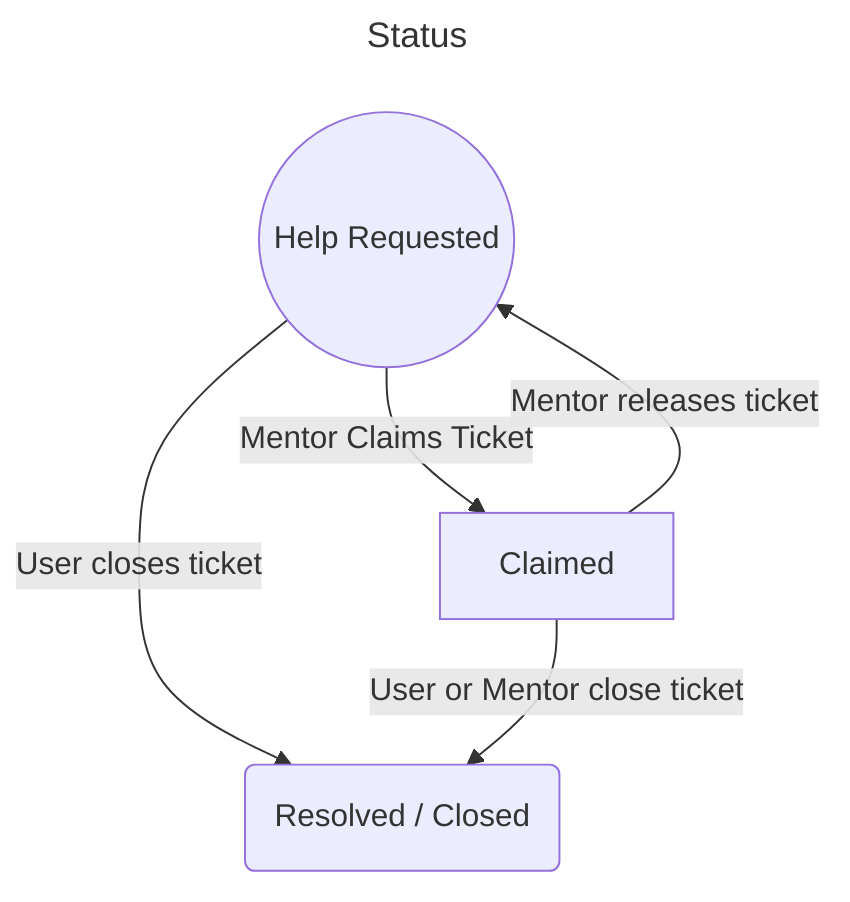

# Mentor Bot

[Technical dependencies](Dependencies.md)

## Entities

### [Users](UserFlows.md)

Create or close tickets.

### [Mentors](MentorFlows.md)

Claim, unclaim, and complete tickets.

### [Leads](LeadFlows.md)

Add and remove mentors.

Adding and removing leads currently requires a manual DB mutation. 

### Tickets

A request for help from a user to a mentor. These are filled out from inside Resonite.

| Property    | Type     | Required | Description                                                |
|-------------|----------|----------|------------------------------------------------------------|
| User        | string   | true     | The ID of the user requesting help                         |
| Mentor      | string   | false    | The ID of the mentor assigned to the ticket, if one is     |
| Created     | DateTime | true     | The timestamp of when the ticket was created               |
| Language    | string   | true     | The local language of the user.                            |
| Description | string   | false    | A user provided description of the ticket.                 |
| Status      | Enum     | true     | The current status of the ticket, see the flowchart below. | 

