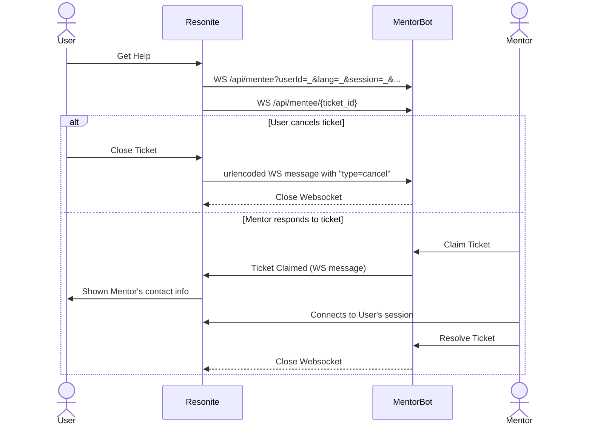

# Mentor Flows

[Root Doc (Start Here)](README.md)

Users do not need to log in to use the API.

## Creating a Ticket (Resonite UI)

The user is prompted to create a ticket using a UI wizard in-engine.

The Resonite client makes a websocket connection to the mentor bot, which sends back ticket updates.

In practice once the client gets the first update (the one saying the ticket was created) the websocket is closed, and the route with a ticket_id is used instead. This was easier to implement in resonite, although it is not good practice.

There is a rate limit on the ticket create call, and additional protections may be needed in the future (such as including the user ID).

